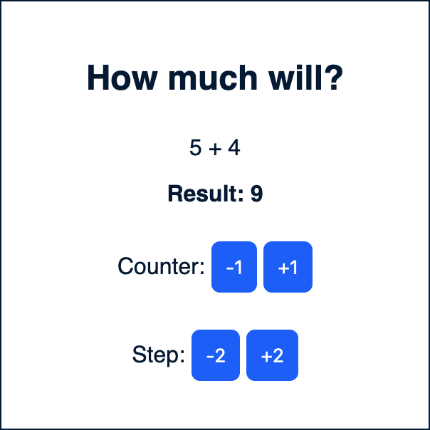
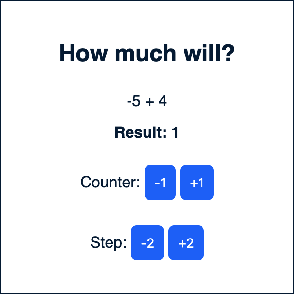

# Реактивность

> Реактивность - это способность приложения быстро реагировать на изменения данных (обновление = отображение). Самое распространённое - синхронизация данных с html

## Описание

Нужно реализовать методы, котрые будут считать результат сложения `counter` и `step`, при этом сами `counter` и `step` можно уменьшать и увеличивать на единицу нажатием на соответсвующие кнопки.

## Условия

`counter` изменяется с шагом 1
`step` изменяется с шагом в 2

*Результат может быть отрицательням.

## Задание

- Создайте методы для реализации на Vue
- Реализуйте обработчики кликов и вычисление результата в части написанной на JS

## Пример

 
